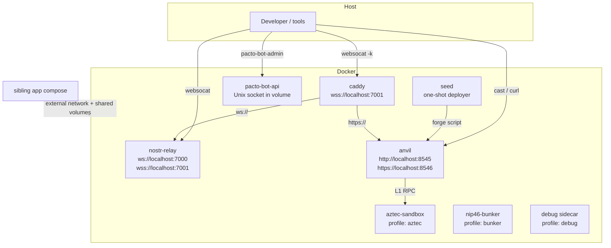

# Pacto Dev Environment — Architecture & Operations

This document is the single reference for what `pacto-dev-env` does, how its services are built, and how the local stack is started and consumed by sibling application repositories.

## Overview

`pacto-dev-env` is a **service orchestration layer**, not an application. It provides the containerized backing services that every Covenant Gov / Pacto project needs for local development:

- A Nostr relay for DM / MLS testing.
- An Anvil EVM testnet for contract development and integration tests.
- An optional Aztec sandbox for `pacto-aztec` work.
- An optional NIP-46 bunker for remote-signing tests.
- The `pacto-bot-api` daemon so bot handlers can connect without running the daemon themselves.
- An optional seed/deployer that deploys the Pacto governance contracts to Anvil.

Application repositories (e.g., `pacto-governance-bots`, `pacto-app`, `pacto-aztec`) should attach to this stack rather than duplicating it.

## What this repo is not

- It is not a production deployment repository.
- It does not contain application code, contract source, or bot handlers.
- It does not ship private keys, daemon configs, or generated deployment artifacts. Those live in ignored files and are created by the operator.

## High-level architecture



All services share a Docker bridge network named `pacto` so sibling composes can reach them by service name. The default stack always starts `nostr-relay`, `anvil`, and `pacto-bot-api`. Optional services are gated by Compose profiles.

### Nostr relay and Anvil TLS

A `caddy` sidecar is part of the default stack and exposes two TLS endpoints on the host:

- `wss://localhost:7001` proxies plain `ws://` to `nostr-relay:8080`.
- `https://localhost:8546` proxies `http://` to `anvil:8545`.

`make up` and `make up-all` run `scripts/generate-local-certs.sh` automatically. If `mkcert` is installed (the setup scripts install it), Caddy uses a locally-trusted certificate. If `mkcert` is not available, Caddy falls back to its internal self-signed CA; clients must then skip certificate verification. To trust the mkcert CA in browsers, run `mkcert -install` once after the certificates are generated.

## Services

| Service | Default | Profile | Purpose | Image source |
|---|---|---|---|---|
| `nostr-relay` | yes | — | Nostr relay for DM/MLS testing | `ghcr.io/covenant-gov/pacto-dev-env/nostr-relay:main` |
| `caddy` | yes | — | TLS sidecar for `wss://localhost:7001` and `https://localhost:8546` | `caddy:2-alpine` |
| `anvil` | yes | — | Local EVM testnet, chain ID 31337 | built locally from `docker/anvil.Dockerfile` |
| `pacto-bot-api` | yes | — | Daemon that bot handlers connect to | `ghcr.io/covenant-gov/pacto-bot-api:latest` |
| `seed` | no | `seed`, `full` | Deploys Pacto governance contracts to Anvil | `pacto-anvil:local` (one-shot) |
| `aztec-sandbox` | no | `aztec`, `full` | Aztec L2 local network | `ghcr.io/covenant-gov/pacto-dev-env/aztec-sandbox:main` |
| `nip46-bunker` | no | `bunker`, `full` | NIP-46 remote-signing server | `ghcr.io/covenant-gov/pacto-dev-env/nip46-bunker:main` |
| `nip46-bunker-db` | no | `bunker`, `full` | Postgres for bunker | `postgres:17-alpine` |
| `nip46-bunker-redis` | no | `bunker`, `full` | Redis for bunker | `redis:8-alpine` |
| `debug` | no | `debug` | Interactive debugging sidecar | built locally from `docker/debug.Dockerfile` |

### Image build strategy

Most services use prebuilt images published to GitHub Container Registry:

- `nostr-relay`
- `nip46-bunker`
- `aztec-sandbox`
- `pacto-bot-api`

The `anvil` image is **not** available from GHCR (the published build failed), so it is built locally from `docker/anvil.Dockerfile`. That Dockerfile compiles Foundry v1.7.1 from source, so the first build can take several minutes. After that, Docker layer caching makes it fast.

The `debug` image is also built locally on demand when the `debug` profile is used.

Images are published by the `release-images.yml` GitHub Actions workflow in this repository. When the `anvil` GHCR build is fixed, the compose file can switch `anvil` to the published image and remove the local build.

## Startup flow

The fastest way to start is the `Makefile`:

```bash
make up          # default stack: relay + anvil + pacto-bot-api
make up-all      # default stack + aztec + bunker + seed
make seed        # run the seed deployer on its own
make seed-squad  # deploy a Nave Pirata squad (requires captain/candidate env vars)
make reseed      # reset, restart, and re-deploy governance contracts
make reseed-all  # reset, restart, deploy contracts, and seed a squad
make dev         # pull + up + optional dev-bot + printed next steps
make down        # stop everything across all profiles
make reset       # stop everything, delete ./data, and clear local deployment artifacts
```

Under the hood:

1. `docker compose pull` fetches the prebuilt GHCR images.
2. `docker compose build anvil` builds the local Anvil image if it is not cached.
3. `docker compose up -d --build` starts the default stack.
4. `scripts/init-pacto-bot-api-config.sh` generates `pacto-bot-api.toml` if it is missing. If `PACTO_CREATE_DEV_BOT=1` and both `PACTO_BOT_NPUB` and `PACTO_BOT_NSEC` are set, it appends a `dev` bot identity; otherwise it creates a daemon-only config.
5. Services with dependencies wait for healthchecks:
   - `pacto-bot-api` waits for `nostr-relay` to be healthy.
   - `aztec-sandbox` waits for `anvil` to be healthy.
   - `nip46-bunker` waits for its DB and Redis to be healthy.
6. When the `seed` profile is active, the one-shot `seed` service runs after `anvil` is healthy and writes `./data/deployments/31337/full-system.json`.

`make seed` is idempotent and self-healing: if `full-system.json` exists and the recorded `NavePirataFactory` is still live on Anvil, the service exits; if the factory is missing (for example, after Anvil was reset), it re-deploys automatically. Set `FORCE_SEED=1` to always re-deploy, or use `make reseed` / `make reseed-all` for a one-command reset and reseed.

### Required operator setup before `make up`

The daemon needs a `pacto-bot-api.toml` configuration file. Generate it from the example and add bot identities:

```bash
cp pacto-bot-api.toml.example pacto-bot-api.toml
chmod 600 pacto-bot-api.toml
pacto-bot-admin new bosun --backend nsec --relays ws://localhost:7000 >> pacto-bot-api.toml
```

`pacto-bot-api.toml` is ignored by Git because it contains signing material.

For the `bunker` or `full` profiles, copy `.env.example` to `.env` and replace the insecure placeholder secrets with real values.

## Profiles

Profiles keep heavy or optional services opt-in.

| Profile | What it adds | Typical use |
|---|---|---|
| (none) | `nostr-relay`, `anvil`, `pacto-bot-api` | Default bot/contract development |
| `seed` | One-shot governance contract deployer | Populate Anvil with Pacto contracts |
| `aztec` | `aztec-sandbox` | Working on `pacto-aztec` |
| `bunker` | `nip46-bunker`, `nip46-bunker-db`, `nip46-bunker-redis` | Remote-signing tests |
| `full` | `aztec` + `bunker` + `seed` | Run the whole stack |
| `debug` | `debug` sidecar | Network/WebSocket debugging |

`make up-all` is equivalent to `docker compose --profile full up -d --build`.

### Squad seeding

After `make seed` has produced `./data/deployments/31337/full-system.json`,
`make seed-squad` deploys a single Nave Pirata squad via
`pacto-gov/script/DeployNavePirata.s.sol`. It is intentionally
**identity-aware** and does not fabricate a dummy single-user squad:

- Required env vars: `PACTO_SQUAD_CAPTAIN_NPUB` and `PACTO_SQUAD_CANDIDATE_NPUB`.
- If they are missing, the script checks `pacto-bot-api.toml` for existing
  `captain` / `candidate` identities and reuses them, or prompts to create them
  automatically inside the `pacto-bot-api` container. Set
  `PACTO_AUTO_CREATE_SQUAD_IDENTITIES=1` to skip the prompt.
- If they are missing and you decline auto-creation, the script prints
  `pacto-bot-admin new` instructions and exits 1.
- `make seed-squad` validates that the Pacto infrastructure is still deployed on Anvil; if the chain has been reset, run `make seed` first, or use `make reseed-all`.
- On success it writes `./data/deployments/31337/squad.json`.
- The captain address is the deployer address (Anvil account #0) for local dev;
  the public-key env vars are captured here so a sibling repo's env generator can
  consume them without re-deriving keys.

## Connecting sibling application composes

Application repositories should not define their own `anvil`, `nostr-relay`, or `aztec-sandbox` services. Instead, they attach to the `pacto` network and the shared daemon socket volume.

### Example app compose attachment

```yaml
services:
  bosun:
    # ...
    networks:
      - pacto
    volumes:
      - pacto-bot-api-data:/var/lib/pacto-bot-api:ro
    environment:
      PACTO_GOVERNANCE_RPC_URL: http://anvil:8545
      PACTO_GOVERNANCE_DAEMON_SOCKET: /var/lib/pacto-bot-api/pacto-bot-api.sock
      PACTO_GOVERNANCE_GROUP_ID: local-dev-squad
```
networks:
  pacto:
    external: true

volumes:
  pacto-bot-api-data:
    external: true
```

Inside the attached container, use service names instead of `localhost`:

- `http://anvil:8545` for the EVM RPC
- `ws://nostr-relay:8080` for the Nostr relay
- `wss://caddy:8443` for the Nostr relay over TLS from inside the Docker network
- `https://caddy:8444` for the Anvil EVM RPC over TLS from inside the Docker network
- `/var/lib/pacto-bot-api/pacto-bot-api.sock` for the daemon socket (via the shared volume)
- `http://aztec-sandbox:8080` for Aztec RPC
- `http://nip46-bunker:3000` for the bunker

Host-facing ports are bound to `127.0.0.1` by default, so they are only reachable from the local machine.

### Shared network / volume / socket contract

Sibling application composes agree on the following contract:

| Resource | Value | Where declared |
|---|---|---|
| External network | `pacto` | `docker-compose.yml` in this repo; `external: true` in sibling composes |
| External named volume | `pacto-bot-api-data` | Created here by `pacto-bot-api`; mounted as `external: true` in sibling composes |
| Daemon socket path | `/var/lib/pacto-bot-api/pacto-bot-api.sock` | `pacto-bot-api.toml` `[daemon]` section |
| Governance deployment artifact | `data/deployments/31337/full-system.json` | Written by the `seed` profile; sibling repos read it relative to `pacto-dev-env` |
| Squad deployment artifact | `data/deployments/31337/squad.json` | Written by `scripts/seed-squad.sh` |

Sibling repos must not redefine `pacto-bot-api-data` as a non-external volume or
change the socket path without a matching migration in every dependent compose.

## Data layout

Runtime data is written to `./data/` and is ignored by Git.

```text
data/
├── relay/              # nostr-relay SQLite database
├── aztec/              # Aztec sandbox data
├── nip46-bunker-db/    # Postgres data
├── deployments/        # Pacto governance deployment artifacts (from seed)
├── cache/              # Foundry cache used by the seed deployer
├── out/                # Foundry build output used by the seed deployer
└── daemon-socket/      # not used; the daemon socket lives in the named volume
```

The `pacto-bot-api` daemon stores its database and Unix socket in a Docker named volume called `pacto-bot-api-data`. This named volume can be shared with sibling app composes as `external: true`.

## Security model

- **Localhost-only by default.** Host-facing ports are mapped to `127.0.0.1` so services are not exposed to the LAN.
- **Secrets are not committed.** `pacto-bot-api.toml`, `.env`, and the `data/` directory are ignored.
- **Daemon config must be owner-readable.** `pacto-bot-api.toml` should be mode `0o600`.
- **Anvil uses the default test private key.** This is fine for local development only.
- **NIP-46 bunker defaults are insecure.** The `.env.example` placeholders must be replaced before use.

## Image release workflow

The `.github/workflows/release-images.yml` workflow builds and pushes multi-arch images for:

- `nostr-relay`
- `anvil`
- `aztec-sandbox`
- `nip46-bunker`

It uses the Dockerfiles in `docker/`. The `anvil` GHCR image is currently failing to build, which is why the local build remains the fallback.

## Troubleshooting

- **Anvil first build is slow.** Foundry compiles from source; expect several minutes. Subsequent builds are cached.
- **Aztec OOMs.** Ensure Docker has at least 8 GB of RAM, preferably 12 GB.
- **Port already in use.** Because ports are bound to `127.0.0.1`, conflicts only happen if another local process is using the same port. Stop the conflicting service or change the port mapping in a `docker-compose.override.yml`.
- **pacto-bot-api fails to start.** Make sure `pacto-bot-api.toml` exists, is mode `0o600`, and contains valid bot identities.
- **Seed deployer fails.** Ensure `../pacto-gov` exists or set `PACTO_GOV_DIR` to the repo path.
- **Debug a running service.** Attach the debug sidecar: `docker compose --profile debug up -d --build` then `docker compose exec debug bash`.
