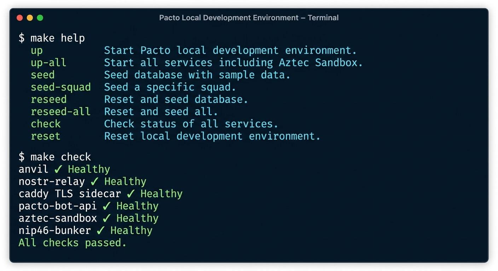
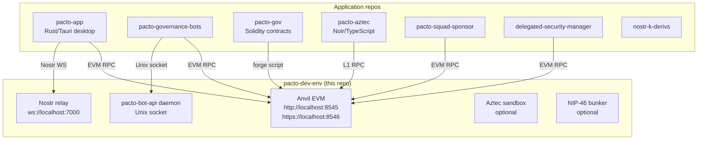

# pacto-dev-env

Local development environment for the Pacto / Covenant Gov ecosystem.

This repo runs the shared containerized services that every Pacto project needs
— a Nostr relay, a local EVM testnet, and the `pacto-bot-api` daemon — so
sibling application repositories can connect to them instead of duplicating
infrastructure.



## What you get

The default stack starts three services plus a Caddy TLS sidecar:

| Service | Endpoint | Purpose |
|---|---|---|
| Nostr relay | `ws://localhost:7000` | Decentralized messaging relay |
| Anvil EVM testnet | `http://localhost:8545` | Local EVM chain (chain ID 31337) |
| Anvil EVM testnet over TLS | `https://localhost:8546` | Anvil via Caddy reverse proxy |
| `pacto-bot-api` | Unix socket in `pacto-bot-api-data` | Bot handler daemon |

Optional profiles add more services:

| Profile | What it adds |
|---|---|
| `aztec` | Aztec sandbox on `http://localhost:8080` and `https://localhost:8445` |
| `bunker` | NIP-46 remote-signing bunker on `http://127.0.0.1:3001` and `https://localhost:8446` |
| `seed` | One-shot deploy of Pacto governance contracts to Anvil |
| `full` | `aztec` + `bunker` + `seed` |
| `debug` | Interactive sidecar with `websocat`, `socat`, `curl`, `jq`, etc. |

## Quick start

### 1. Prepare your host

Run the one-shot setup script for your platform. Both scripts are idempotent.

**macOS (Apple Silicon):**

```bash
bash ./setup-macos-arm64.sh
```

**Ubuntu 24.04/24.10/26.04 LTS:**

```bash
bash ./setup-ubuntu-lts.sh
```

Open a new shell afterward so PATH changes take effect. For custom setups or manual prerequisites, see [`docs/setup.md`](docs/setup.md).

If this is your first time on this machine, trust the local TLS certificate authority so Pacto can use the `https://` and `wss://` endpoints without certificate warnings:

```bash
mkcert -install
```

You only need to do this once. If `mkcert` is not installed, the setup scripts installed it; if you skipped the scripts, see `docs/setup.md` for manual installation.

### 2. Start the services

```bash
cd pacto-dev-env
make up
```

`make up` builds the local Anvil image on first run, generates or refreshes
Caddy's TLS certificates (using mkcert if available, otherwise Caddy's
self-signed CA), and starts the default stack. This can take a few minutes
the first time.

If you want everything at once (including Aztec, bunker, and the governance
seeder), use `make up-all` instead.

### 3. Seed the Pacto governance system (optional)

Required if you are working on governance contracts, bots, or the desktop app
treasury features:

```bash
make seed
```

`make seed` deploys the Pacto contracts from the sibling `pacto-gov` repository
and writes deployment artifacts to `./data/deployments/31337/full-system.json`.
It is idempotent and self-healing: if Anvil is reset, it re-deploys
automatically.

### 4. Seed a Nave Pirata squad (optional)

Required for squad/treasury/mutiny testing:

```bash
PACTO_AUTO_CREATE_SQUAD_IDENTITIES=1 make seed-squad
```

This creates the captain and candidate identities inside the
`pacto-bot-api` container and deploys a squad to Anvil. The squad artifact is
written to `./data/deployments/31337/squad.json`.

For manual identity creation, see [`docs/workflows.md`](docs/workflows.md).

### 5. Verify everything

```bash
make check
```

You should see all containers healthy and the services responding. If anything
is missing, `make check` prints the remediation step for your platform.

### 6. Work on a project

With the services running, switch to a sibling repository and start working.
Quick pointers:

```bash
# Desktop app
cd ~/src/covenant-gov/pacto-app
pnpm install
pnpm run tauri:dev

# Solidity contracts
cd ~/src/covenant-gov/pacto-gov
forge test

# Bot handlers
cd ~/src/covenant-gov/pacto-governance-bots
# see that repo's README for env generation and startup
```

For detailed per-project workflows, see [`docs/workflows.md`](docs/workflows.md).

## How this repo connects to the ecosystem



Sibling repositories attach to the shared `pacto` Docker network and the
`pacto-bot-api-data` volume so their containers can reach these services by
service name. For the exact connection contract, see
[`ARCHITECTURE.md`](ARCHITECTURE.md).

## Common commands

```bash
make help          # list all targets
make up            # start the default stack
make up-all        # start the full stack
make seed          # deploy Pacto governance contracts
make seed-squad    # deploy a Nave Pirata squad
make reseed        # reset, restart, and re-seed contracts
make reseed-all    # reset, restart, seed, and deploy a squad
make check         # verify the stack is healthy
make pacto-connect # print Pacto connection URLs (wss/https)
make reset         # stop everything and clear state
```

## Where to go next

| I want to... | Read this |
|---|---|
| Set up my machine manually or understand the prerequisites | [`docs/setup.md`](docs/setup.md) |
| Work on `pacto-app`, `pacto-gov`, `pacto-aztec`, or another repo | [`docs/workflows.md`](docs/workflows.md) |
| Connect a sibling repo to the shared network/volume | [`ARCHITECTURE.md`](ARCHITECTURE.md) |
| Fix something that isn't working | [`docs/troubleshooting.md`](docs/troubleshooting.md) |
| Let an LLM navigate this repo | [`llms.md`](llms.md) |

## Security notes

- All local services bind to `localhost` by default. Do not expose them to the
  public internet.
- Never commit private keys or bunker URIs to Git.
- `pacto-bot-api.toml` is created with mode `0o600` and ignored by Git.
- The default Anvil private key is for local development only:
  `0xac0974bec39a17e36ba4a6b4d238ff944bacb478cbed5efcae784d7bf4f2ff80`.

## Sources

- Pacto app repo: https://github.com/covenant-gov/pacto-app
- Build guides for `pacto-app` are in that repository under `docs/build/`.
