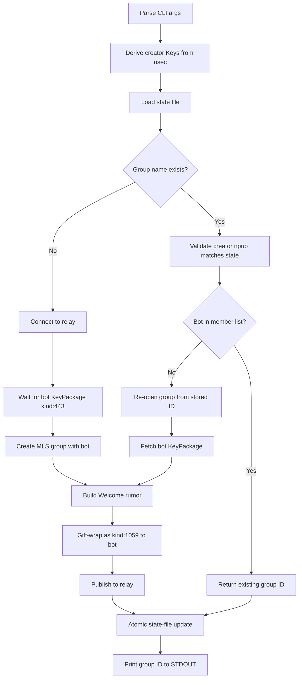

# Create a headless MLS group creation tool

> **Status (2026-07-09): superseded.** This plan described a standalone
> `create-mls-group` Rust binary in `pacto-bot-api`. The shipped implementation
> is daemon-backed (`pacto-bot-admin mls-group`) and is documented in
> [`../pacto-bot-api/docs/plans/2026-07-09-001-feat-daemon-backed-mls-group-admin-plan.md`](../pacto-bot-api/docs/plans/2026-07-09-001-feat-daemon-backed-mls-group-admin-plan.md).
> The `pacto-dev-env` operator workflow is in `../../AGENTS.md` and
> `../../handover-create-mls-group-tool.md`.

## Summary

Add a `pacto-bot-utils` crate to the `pacto-bot-api` repository containing a `create-mls-group` binary. The binary is included in the `pacto-bot-api` Docker image and invoked from `pacto-dev-env` via a wrapper script and Make target. The tool creates or re-opens an MLS group, invites a bot by npub, and prints the group wire ID to STDOUT. A local state file in `pacto-dev-env` makes repeated runs idempotent.

**Target repos:**
- `pacto-bot-api` — new `pacto-bot-utils` crate and Docker image changes
- `pacto-dev-env` — wrapper script, Make target, and Docker Compose mount

## Problem Frame

The only production path for creating an MLS group for Pacto bots is through the Pacto desktop app. This blocks headless local development and CI. The tool removes that dependency by reusing the same MLS primitives as `pacto-bot-api`'s `mock_mls_peer.rs` test support code. Placing the tool in the `pacto-bot-api` repo keeps it next to the canonical reference implementation and lets it ride along in the existing Docker image, so `pacto-dev-env` contributors do not need a Rust toolchain.

## Requirements

- R1. The CLI accepts `--bot-npub`, `--group-name`, `--relay`, `--state-file`, and `--mls-db` with the defaults specified in the origin requirements doc. The creator nsec is supplied via one of `--nsec`, `PACTO_MLS_CREATOR_NSEC`, or `--nsec-file`.
- R2. The tool derives the creator MLS identity from the supplied nsec and zeroizes the secret after loading it.
- R3. The tool connects to the relay and waits for the bot's `kind:443` KeyPackage to appear before creating a group or generating an invitation.
- R4. If the group name does not exist in the state file, the tool creates a new MLS group, invites the bot as the initial member, and publishes a `kind:1059` Welcome gift-wrap.
- R5. If the group name exists, the tool validates that the supplied nsec derives the same creator npub stored in the state file; if not, it exits with an error.
- R6. If the bot is not already a member of the existing group, the tool re-opens the group, fetches the bot's KeyPackage, generates a Welcome, and publishes it as a `kind:1059` gift-wrap.
- R7. If the bot is already a member, the tool does not publish a new Welcome.
- R8. On success, the tool prints the hex-encoded MLS group wire ID (`h` tag value) to STDOUT and exits `0`.
- R9. The tool updates the state file atomically to record the group name, group ID, creator npub, relay, and invited bot npubs.
- R10. The tool is idempotent: running with the same `--group-name` and `--bot-npub` returns the same group ID without duplicating membership.
- R11. The tool exits non-zero with a concise error message on unreachable relay, KeyPackage timeout, invalid nsec, mismatched creator identity, or corrupted state file.

## Key Technical Decisions

- **KTD1. Tool lives in `pacto-bot-api` as a new `pacto-bot-utils` crate.** The reference implementation (`mock_mls_peer.rs`) and the exact `mdk` dependency versions already live in `pacto-bot-api`. Keeping the tool there avoids re-declaring Git dependencies and drift.
- **KTD2. Container invocation via `docker compose exec`.** The `pacto-bot-api` image is already running in the dev stack. A wrapper script invokes `docker compose exec pacto-bot-api create-mls-group ...` so contributors do not need Rust locally.
- **KTD3. State file lives in `pacto-dev-env/data/deployments/31337/.mls-groups.json`.** The state is developer-local and gitignored, not part of the daemon's persistent volume. The container mounts `./data/deployments:/data/deployments` to read and write it.
- **KTD4. Use `MDK<MdkSqliteStorage>` with a persistent SQLite database in the shared state directory.** MLS group state (epoch secrets, tree) is required to add members to an existing group. The tool's SQLite database must persist across runs, alongside the JSON state file. The JSON file records metadata and invited-bot npubs; the SQLite database stores the actual MLS group state.
- **KTD5. Port `gift_wrap_welcome` from `pacto-bot-api/tests/support/mock_mls_peer.rs` and derive the wire ID from the group result.** `gift_wrap_welcome` is the canonical source of truth for the Welcome gift-wrap format. The wire ID is the hex-encoded `nostr_group_id` from the returned `GroupResult`, not extracted from a message wrapper.
- **KTD6. Accept nsec via environment variable or file by default, with `--nsec` as a dev-only convenience.** Passing raw secrets on the command line exposes them to process lists, shell history, and container logs. The default input path is `PACTO_MLS_CREATOR_NSEC` or `--nsec-file`; the `--nsec` flag is supported for local dev workflows but discouraged.
- **KTD7. The creator identity must match the stored group creator.** A group can only be re-opened by the same creator. The tool validates the derived creator npub against the stored creator npub before re-opening.

## High-Level Technical Design

## Implementation Units

### U1. Scaffold `pacto-bot-utils` crate in `pacto-bot-api`

- **Goal:** Create a new Rust crate in the `pacto-bot-api` workspace for headless utility binaries.
- **Requirements:** R1, R2
- **Dependencies:** None
- **Files:**
  - `pacto-bot-api/crates/pacto-bot-utils/Cargo.toml`
  - `pacto-bot-api/crates/pacto-bot-utils/src/main.rs`
  - `pacto-bot-api/Cargo.toml` (add workspace member)
- **Approach:** Add a new crate under the existing workspace. Use the same `mdk-core`, `mdk-sqlite-storage`, `nostr-sdk`, `nostr`, `tokio`, `clap`, `serde_json`, `serde`, and `hex` versions as the main `pacto-bot-api` crate. Add a `[[bin]]` entry for `create-mls-group`.
- **Patterns to follow:** Existing workspace layout in `pacto-bot-api/Cargo.toml` (`members = [".", "xtask", "crates/governance-bot"]`).
- **Test scenarios:**
  - `cargo check -p pacto-bot-utils` passes.
  - The binary name resolves to `create-mls-group`.
- **Verification:** Running `cargo build -p pacto-bot-utils` produces `target/release/create-mls-group`.

### U2. Implement CLI and local state management

- **Goal:** Parse arguments and read/write the local JSON state file and persistent MLS database safely.
- **Requirements:** R1, R9, R11
- **Dependencies:** U1
- **Files:**
  - `pacto-bot-api/crates/pacto-bot-utils/src/cli.rs`
  - `pacto-bot-api/crates/pacto-bot-utils/src/state.rs`
- **Approach:** Use `clap` derive for argument parsing. The creator nsec is accepted via `--nsec`, `PACTO_MLS_CREATOR_NSEC`, or `--nsec-file`; load it into a `SecretString` and zeroize it after use. Define a `StateFile` struct with a `version` field and a `groups` map keyed by group name. Implement atomic write (temp file + rename) and advisory file locking. Validate that stored group names are non-empty and trimmed. On schema mismatch or malformed entries, fail with a clear error rather than overwriting silently.
- **Patterns to follow:** `serde_json` with `derive` for serialization; `secrecy` for the nsec; `fs2` or similar for file locking if needed.
- **Test scenarios:**
  - Running the binary with missing required args exits non-zero and prints usage.
  - A state file round-trip preserves group data.
  - Concurrent writes do not corrupt the file.
  - Loading a malformed state file exits with a clear error.
  - The nsec is not printed in help text or error messages.
- **Verification:** Unit tests pass and the binary handles missing/invalid state files correctly.

### U3. Implement relay client and KeyPackage fetch

- **Goal:** Connect to the Nostr relay and wait for the bot's `kind:443` KeyPackage.
- **Requirements:** R3, R11
- **Dependencies:** U1
- **Files:**
  - `pacto-bot-api/crates/pacto-bot-utils/src/relay.rs`
- **Approach:** Use `nostr-sdk` to create a short-lived client. Subscribe to `kind:443` events from the bot's public key. Wait with a timeout (configurable, default 30 seconds). Return the first matching event or a timeout error.
- **Patterns to follow:** `nostr-sdk` client usage in `pacto-bot-api` source code.
- **Test scenarios:**
  - KeyPackage is returned when the bot publishes one before the timeout.
  - Timeout exits with a clear error when no KeyPackage is found.
  - Relay connection failure exits with a concise error.
- **Verification:** A test against the local relay in `pacto-dev-env` (or an integration test) can fetch a KeyPackage.

### U4. Implement MLS group creation and re-opening

- **Goal:** Create a new MLS group or re-open an existing one and add the bot as a member.
- **Requirements:** R2, R4, R5, R6, R7, R11
- **Dependencies:** U1, U2, U3
- **Files:**
  - `pacto-bot-api/crates/pacto-bot-utils/src/mls.rs`
- **Approach:** Initialize `MDK<MdkSqliteStorage>` with a persistent SQLite database at the path given by `--mls-db` (default `/data/deployments/31337/.mls-creator.db`). Mirror `MockMlsPeer::create_group_with` for new groups. For existing groups, load the group from the persistent database using the stored group ID and validate that the creator npub derived from the supplied nsec matches the stored creator npub. If the bot is already recorded in the state file, skip re-invitation; otherwise fetch the bot's KeyPackage and generate a Welcome.
- **Patterns to follow:** `pacto-bot-api/tests/support/mock_mls_peer.rs`.
- **Test scenarios:**
  - New group creation returns a group result and a Welcome rumor.
  - Re-opening an existing group with a matching creator succeeds.
  - Re-opening with a mismatched creator exits with an error.
  - Adding a second bot to an existing group generates a new Welcome.
  - The SQLite database persists across runs in the mounted state directory.
- **Verification:** The tool produces distinct group IDs for different group names and the same group ID for the same group name.

### U5. Implement Welcome gift-wrap and publish

- **Goal:** Wrap the Welcome rumor as a `kind:1059` gift-wrap addressed to the bot and publish it to the relay.
- **Requirements:** R4, R6, R8
- **Dependencies:** U1, U3, U4
- **Files:**
  - `pacto-bot-api/crates/pacto-bot-utils/src/welcome.rs`
- **Approach:** Port `gift_wrap_welcome` from `mock_mls_peer.rs`, refactoring it to return `Result` and avoid `expect`. It signs a gift-wrap event with the sender's keys, seals the welcome rumor for the recipient, and returns a `kind:1059` event. Publish via the relay client from U3. Derive the group wire ID by hex-encoding the `nostr_group_id` from the `GroupResult` returned by group creation.
- **Patterns to follow:** `pacto-bot-api/tests/support/mock_mls_peer.rs`.
- **Test scenarios:**
  - The published event is `kind:1059` and addressed to the bot's public key.
  - The group wire ID is a 64-character hex string.
  - No Welcome is published when the bot is already recorded in the state file.
- **Verification:** The daemon's `vector-mls.db` shows a new `groups` row after the Welcome is processed.

### U6. Wire main orchestration and binary output

- **Goal:** Bring the components together into a coherent CLI flow.
- **Requirements:** R8, R10, R11
- **Dependencies:** U2, U3, U4, U5
- **Files:**
  - `pacto-bot-api/crates/pacto-bot-utils/src/main.rs`
- **Approach:** Implement the flow from the High-Level Technical Design diagram. Load state, check for existing group, validate creator, create or re-open, fetch KeyPackage, generate and publish Welcome if needed, update state atomically, print group ID to STDOUT. Use `anyhow` or `thiserror` for top-level error propagation and concise STDERR messages.
- **Patterns to follow:** Binary error handling in `pacto-bot-api/src/main.rs` and `pacto-bot-api/src/admin.rs`.
- **Test scenarios:**
  - First run prints a group ID and writes the state file.
  - Second run with the same group and bot prints the same group ID and does not publish a Welcome.
  - Third run with the same group and a different bot prints the same group ID and publishes a second Welcome.
- **Verification:** Acceptance examples AE1–AE4 pass manually or via integration tests.

### U7. Include the binary in the `pacto-bot-api` Docker image

- **Goal:** Ensure the `pacto-bot-api` Docker image contains the `create-mls-group` binary.
- **Requirements:** None directly; enables R1–R11 from inside the container.
- **Dependencies:** U6
- **Files:**
  - `pacto-bot-api/Dockerfile`
- **Approach:** Add `crates/pacto-bot-utils` to the builder stage and compile the `create-mls-group` binary. Copy the binary into the runtime image alongside `pacto-bot-api` and `pacto-bot-admin`. Keep the multi-stage build pattern (builder + runtime). If the Dockerfile currently copies each crate individually, add the new crate; if it copies `crates` wholesale, no new COPY is needed.
- **Patterns to follow:** Existing Dockerfile multi-stage build for `pacto-bot-api`.
- **Test scenarios:**
  - The built image contains `/usr/local/bin/create-mls-group` (or equivalent).
  - Running the binary in the container prints usage/help.
- **Verification:** `docker build` for the `pacto-bot-api` image succeeds and the binary is present.

### U8. Add `pacto-dev-env` wrapper script and Make target

- **Goal:** Provide a convenient host-side command that invokes the containerized tool.
- **Requirements:** R1, R11
- **Dependencies:** U7
- **Files:**
  - `pacto-dev-env/scripts/create-mls-group.sh`
  - `pacto-dev-env/Makefile`
- **Approach:** Write a thin Bash wrapper that passes arguments and environment through to the container binary. Read the creator nsec from `PACTO_MLS_CREATOR_NSEC` or a file and pass it to the container. Run `docker compose exec pacto-bot-api create-mls-group` with the correct arguments. The default `--relay` inside the container is `ws://nostr-relay:8080`, the default `--state-file` is `/data/deployments/31337/.mls-groups.json`, and the default `--mls-db` is `/data/deployments/31337/.mls-creator.db`. Add `make create-mls-group` to the Makefile.
- **Patterns to follow:** `scripts/seed-squad.sh` for error/warn logging, env var handling, and `SCRIPT_DIR/REPO_ROOT` resolution. Avoid relay pre-checks that duplicate the binary's own validation; rely on the binary's error handling for an unreachable relay.
- **Test scenarios:**
  - The wrapper passes the correct container paths for `--relay`, `--state-file`, and `--mls-db`.
  - `make create-mls-group` runs the wrapper with the required args.
  - The wrapper does not log or echo the nsec.
- **Verification:** Running `PACTO_MLS_CREATOR_NSEC=nsec1... make create-mls-group BOT_NPUB=... GROUP_NAME=...` produces a group ID on STDOUT.

### U9. Mount the state directory and add a local build context for `pacto-bot-api`

- **Goal:** Allow the containerized binary to read and write the local state files, and ensure the dev stack uses a locally built image that contains the new binary.
- **Requirements:** R9, R10
- **Dependencies:** U7, U8
- **Files:**
  - `pacto-dev-env/docker-compose.yml`
- **Approach:** Add a bind mount from `./data/deployments` to `/data/deployments` in the `pacto-bot-api` service. Add a `build:` section pointing to the `pacto-bot-api` repository's Dockerfile so `docker compose up --build` rebuilds the image when the source changes. Set `pull_policy: if_not_present` or remove `pull_policy: always` so local builds take precedence over the remote image during development.
- **Patterns to follow:** Existing `seed` service bind mounts and the `anvil` service local build pattern.
- **Test scenarios:**
  - After running the tool, the state file and MLS database exist on the host at `data/deployments/31337/`.
  - Re-running the tool reads the same files and returns the same group ID.
  - `make up` builds a fresh image that includes the `create-mls-group` binary.
- **Verification:** The wrapper's second run with the same group and bot is a no-op.

## Scope Boundaries

- Extending `make seed-squad` to auto-create an MLS group is not in scope.
- Inviting multiple bots in a single invocation is not in scope; one bot per invocation.
- Auto-populating `.env` files in `pacto-governance-bots` or other sibling repos is not in scope.
- Persistent creator identity management is not in scope; the caller must supply the nsec via `--nsec`, `PACTO_MLS_CREATOR_NSEC`, or `--nsec-file` on every run.
- A `--wait-for-daemon` flag that polls the daemon's `vector-mls.db` is not in scope; verification is manual per the origin doc's verification commands.

## Risks & Dependencies

- **Two-repository coordination.** The tool requires changes in both `pacto-bot-api` and `pacto-dev-env`. The `pacto-dev-env` changes depend on a new `pacto-bot-api` image being built.
- **Docker image build time.** Adding `pacto-bot-utils` to the image increases build time. Consider caching the builder stage.
- **MDK version sync.** The tool must use the same `mdk-core` / `mdk-sqlite-storage` revision as the daemon. Since it lives in the same workspace, it shares the same Cargo.lock.
- **Container path assumptions.** The wrapper relies on the container internal paths (`/data/deployments`, `ws://nostr-relay:8080`). A future change to the Docker image or Compose network could break the wrapper.
- **Secret handling.** The tool accepts a creator nsec. Passing it via `--nsec` exposes the secret to process lists, shell history, and container logs. The plan uses `PACTO_MLS_CREATOR_NSEC` / `--nsec-file` by default and zeroizes the secret after loading, but the dev-only `--nsec` flag remains a risk if used in scripts.
- **State file is developer-local.** The JSON state file and SQLite database are gitignored and stored under `data/deployments/31337/`. If they are deleted or moved, a new group is created. The tool does not query the daemon's database for membership confirmation.
- **State file concurrency.** Concurrent invocations could race on the state file or SQLite database. The plan requires atomic writes and advisory locking, but cross-platform locking behavior should be verified on the target platforms.

## Acceptance Examples

- AE1. First run: `PACTO_MLS_CREATOR_NSEC=nsec1... make create-mls-group BOT_NPUB=npub1... GROUP_NAME=local-dev-squad` creates a group, prints a 64-character hex group ID, and exits `0`.
- AE2. Second run with the same `GROUP_NAME` and `BOT_NPUB`: prints the same group ID and exits `0` without publishing a new Welcome.
- AE3. Third run with the same `GROUP_NAME` and a different `BOT_NPUB`: prints the same group ID, publishes a Welcome to the new bot, and exits `0`.
- AE4. Run with a different `GROUP_NAME`: creates a second group with a different group ID and exits `0`.
- AE5. Error path: running with an invalid `PACTO_MLS_CREATOR_NSEC` exits non-zero with a concise error message on STDERR.
- AE6. Error path: running when the relay is unreachable exits non-zero with a concise error message on STDERR.

## Sources & Research

- Origin requirements doc: `docs/brainstorms/2026-07-08-create-mls-group-tool-requirements.md`
- Canonical reference implementation: `pacto-bot-api/tests/support/mock_mls_peer.rs` (sibling repo)
- Dependency versions: `pacto-bot-api/Cargo.toml` (sibling repo)
- Existing one-shot script patterns: `pacto-dev-env/scripts/seed-squad.sh`, `pacto-dev-env/scripts/verify-squad.sh`
- Existing Docker Compose one-shot service pattern: `pacto-dev-env/docker-compose.yml` `seed` service
- Existing orchestration patterns: `pacto-dev-env/Makefile`
